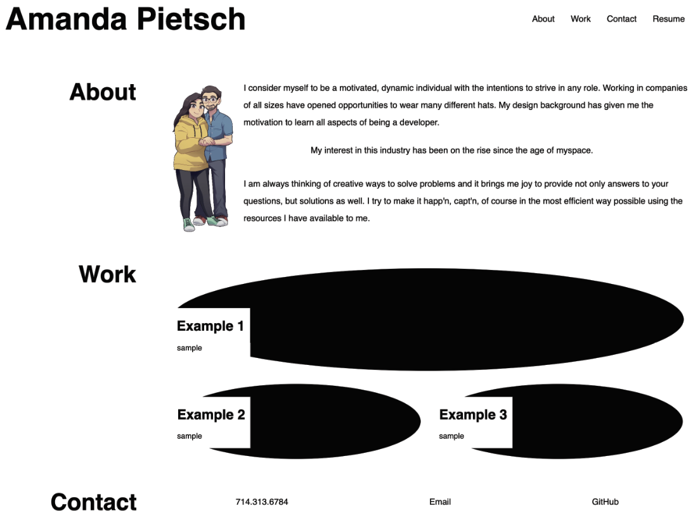

# Portfolio

## Description

Having a portfolio is great to have in order to give other people the opportunity to look at your work. This was built to show my capabilities that pertain to developing. It allows a viewer to review details of the items that I have developed. I have learned the foundation of css/html as it pertains to creating a basic page. 

## Usage

Review work that I have created in the past to show my capabilities. It gives a brief description about me and contact information. The "examples" on my portfolio are just placeholders for now as I have no examples to show currently. 

## Credits

For reference, I used the challenge 2 sample and values to help guide the formatting of this challenge.

## Submission 

Github URL: https://github.com/apietsch4117/portfolio

Deployed Page: https://apietsch4117.github.io/portfolio/